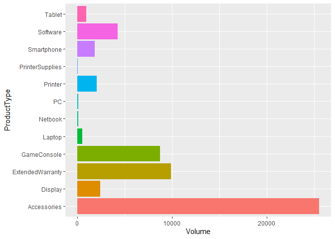

## Objective
#### We have been asked by an Electronics Company to forecast sales of new products that they are considering for building up inventory. Specifically, they would like for us to predict sales volume for four different product types: PCs, Laptops, Netbooks, and Smartphones, which will be used to determine which new products will be brought into store inventory.

#### They would also like for us to analyze the impact Customer Reviews and Service Reviews have on sales volume.

## Goal
#### Our goals are to 1) assess the impact Customer Reviews and Service Reviews have on sales, and 2) build a model that can predict sales volume on new products with at least 85% level of certainty (R2) and minimal error (RMSE). We will build three different algorithms (Random Forest, Support Vector Machines RBF kernel, and Gradient Boosting) and utilize a variety of automatic and manual tuning mechanisms to optimize models.

## Data Description
#### Data consists of service reviews, customer reviews, historical sales data, and product descriptions for all products currently in inventory. The target variable for this project is sales 'Volume' for the product types: PC, Laptops, Netbooks, and Smartphones.

### Loading packages

```r
library(tidyverse)
library(caret)
library(ggplot2)
library(corrplot)
library(openxlsx)
library(kableExtra)
library(dplyr)
library(scales)
```

## Import data

```r
existing <- read.csv(file.path('C:/Users/jlbro/OneDrive/C3T3', 'existing.csv'), 
                     stringsAsFactors = TRUE)
```

## Check structure

```r
str(existing)
```

```
## 'data.frame':	80 obs. of  18 variables:
##  $ ProductType          : Factor w/ 12 levels "Accessories",..: 7 7 7 5 5 1 1 1 1 1 ...
##  $ ProductNum           : int  101 102 103 104 105 106 107 108 109 110 ...
##  $ Price                : num  949 2250 399 410 1080 ...
##  $ x5StarReviews        : int  3 2 3 49 58 83 11 33 16 10 ...
##  $ x4StarReviews        : int  3 1 0 19 31 30 3 19 9 1 ...
##  $ x3StarReviews        : int  2 0 0 8 11 10 0 12 2 1 ...
##  $ x2StarReviews        : int  0 0 0 3 7 9 0 5 0 0 ...
##  $ x1StarReviews        : int  0 0 0 9 36 40 1 9 2 0 ...
##  $ PositiveServiceReview: int  2 1 1 7 7 12 3 5 2 2 ...
##  $ NegativeServiceReview: int  0 0 0 8 20 5 0 3 1 0 ...
##  $ Recommendproduct     : num  0.9 0.9 0.9 0.8 0.7 0.3 0.9 0.7 0.8 0.9 ...
##  $ BestSellersRank      : int  1967 4806 12076 109 268 64 NA 2 NA 18 ...
##  $ ShippingWeight       : num  25.8 50 17.4 5.7 7 1.6 7.3 12 1.8 0.75 ...
##  $ ProductDepth         : num  23.9 35 10.5 15 12.9 ...
##  $ ProductWidth         : num  6.62 31.75 8.3 9.9 0.3 ...
##  $ ProductHeight        : num  16.9 19 10.2 1.3 8.9 ...
##  $ ProfitMargin         : num  0.15 0.25 0.08 0.08 0.09 0.05 0.05 0.05 0.05 0.05 ...
##  $ Volume               : int  12 8 12 196 232 332 44 132 64 40 ...
```

#### Notice that an important variable, 'ProductType' has 12 levels. Regression algorithms can easily misinterpret categorical variables in which there are more than 2 values (it may treat them as ranked or ordinal values), so we need to turn each ProductType level into a 'dummy' variable. This will turn each 'ProductType' into it's own variable with only 2 values, '0' for false and '1' for true. 


```r
dummy <- dummyVars(' ~ .', data = existing)
existing2 <- data.frame(predict(dummy, newdata = existing))
# check structure
str(existing2)
```

```
## 'data.frame':	80 obs. of  29 variables:
##  $ ProductType.Accessories     : num  0 0 0 0 0 1 1 1 1 1 ...
##  $ ProductType.Display         : num  0 0 0 0 0 0 0 0 0 0 ...
##  $ ProductType.ExtendedWarranty: num  0 0 0 0 0 0 0 0 0 0 ...
##  $ ProductType.GameConsole     : num  0 0 0 0 0 0 0 0 0 0 ...
##  $ ProductType.Laptop          : num  0 0 0 1 1 0 0 0 0 0 ...
##  $ ProductType.Netbook         : num  0 0 0 0 0 0 0 0 0 0 ...
##  $ ProductType.PC              : num  1 1 1 0 0 0 0 0 0 0 ...
##  $ ProductType.Printer         : num  0 0 0 0 0 0 0 0 0 0 ...
##  $ ProductType.PrinterSupplies : num  0 0 0 0 0 0 0 0 0 0 ...
##  $ ProductType.Smartphone      : num  0 0 0 0 0 0 0 0 0 0 ...
##  $ ProductType.Software        : num  0 0 0 0 0 0 0 0 0 0 ...
##  $ ProductType.Tablet          : num  0 0 0 0 0 0 0 0 0 0 ...
##  $ ProductNum                  : num  101 102 103 104 105 106 107 108 109 110 ...
##  $ Price                       : num  949 2250 399 410 1080 ...
##  $ x5StarReviews               : num  3 2 3 49 58 83 11 33 16 10 ...
##  $ x4StarReviews               : num  3 1 0 19 31 30 3 19 9 1 ...
##  $ x3StarReviews               : num  2 0 0 8 11 10 0 12 2 1 ...
##  $ x2StarReviews               : num  0 0 0 3 7 9 0 5 0 0 ...
##  $ x1StarReviews               : num  0 0 0 9 36 40 1 9 2 0 ...
##  $ PositiveServiceReview       : num  2 1 1 7 7 12 3 5 2 2 ...
##  $ NegativeServiceReview       : num  0 0 0 8 20 5 0 3 1 0 ...
##  $ Recommendproduct            : num  0.9 0.9 0.9 0.8 0.7 0.3 0.9 0.7 0.8 0.9 ...
##  $ BestSellersRank             : num  1967 4806 12076 109 268 ...
##  $ ShippingWeight              : num  25.8 50 17.4 5.7 7 1.6 7.3 12 1.8 0.75 ...
##  $ ProductDepth                : num  23.9 35 10.5 15 12.9 ...
##  $ ProductWidth                : num  6.62 31.75 8.3 9.9 0.3 ...
##  $ ProductHeight               : num  16.9 19 10.2 1.3 8.9 ...
##  $ ProfitMargin                : num  0.15 0.25 0.08 0.08 0.09 0.05 0.05 0.05 0.05 0.05 ...
##  $ Volume                      : num  12 8 12 196 232 332 44 132 64 40 ...
```

#### Notice each product type is it's own variable. The regression algorithms will now be able to better understand each. We only need PC, Laptop, Netbook, and Smartphone, so let's remove all other product types.

### Check summary for descriptive stats and NAs

```r
summary(existing2)
```

```
##  ProductType.Accessories ProductType.Display ProductType.ExtendedWarranty
##  Min.   :0.000           Min.   :0.0000      Min.   :0.000               
##  1st Qu.:0.000           1st Qu.:0.0000      1st Qu.:0.000               
##  Median :0.000           Median :0.0000      Median :0.000               
##  Mean   :0.325           Mean   :0.0625      Mean   :0.125               
##  3rd Qu.:1.000           3rd Qu.:0.0000      3rd Qu.:0.000               
##  Max.   :1.000           Max.   :1.0000      Max.   :1.000               
##                                                                          
##  ProductType.GameConsole ProductType.Laptop ProductType.Netbook ProductType.PC
##  Min.   :0.000           Min.   :0.0000     Min.   :0.000       Min.   :0.00  
##  1st Qu.:0.000           1st Qu.:0.0000     1st Qu.:0.000       1st Qu.:0.00  
##  Median :0.000           Median :0.0000     Median :0.000       Median :0.00  
##  Mean   :0.025           Mean   :0.0375     Mean   :0.025       Mean   :0.05  
##  3rd Qu.:0.000           3rd Qu.:0.0000     3rd Qu.:0.000       3rd Qu.:0.00  
##  Max.   :1.000           Max.   :1.0000     Max.   :1.000       Max.   :1.00  
##                                                                               
##  ProductType.Printer ProductType.PrinterSupplies ProductType.Smartphone
##  Min.   :0.00        Min.   :0.0000              Min.   :0.00          
##  1st Qu.:0.00        1st Qu.:0.0000              1st Qu.:0.00          
##  Median :0.00        Median :0.0000              Median :0.00          
##  Mean   :0.15        Mean   :0.0375              Mean   :0.05          
##  3rd Qu.:0.00        3rd Qu.:0.0000              3rd Qu.:0.00          
##  Max.   :1.00        Max.   :1.0000              Max.   :1.00          
##                                                                        
##  ProductType.Software ProductType.Tablet   ProductNum        Price        
##  Min.   :0.000        Min.   :0.0000     Min.   :101.0   Min.   :   3.60  
##  1st Qu.:0.000        1st Qu.:0.0000     1st Qu.:120.8   1st Qu.:  52.66  
##  Median :0.000        Median :0.0000     Median :140.5   Median : 132.72  
##  Mean   :0.075        Mean   :0.0375     Mean   :142.6   Mean   : 247.25  
##  3rd Qu.:0.000        3rd Qu.:0.0000     3rd Qu.:160.2   3rd Qu.: 352.49  
##  Max.   :1.000        Max.   :1.0000     Max.   :200.0   Max.   :2249.99  
##                                                                           
##  x5StarReviews    x4StarReviews    x3StarReviews    x2StarReviews   
##  Min.   :   0.0   Min.   :  0.00   Min.   :  0.00   Min.   :  0.00  
##  1st Qu.:  10.0   1st Qu.:  2.75   1st Qu.:  2.00   1st Qu.:  1.00  
##  Median :  50.0   Median : 22.00   Median :  7.00   Median :  3.00  
##  Mean   : 176.2   Mean   : 40.20   Mean   : 14.79   Mean   : 13.79  
##  3rd Qu.: 306.5   3rd Qu.: 33.00   3rd Qu.: 11.25   3rd Qu.:  7.00  
##  Max.   :2801.0   Max.   :431.00   Max.   :162.00   Max.   :370.00  
##                                                                     
##  x1StarReviews     PositiveServiceReview NegativeServiceReview Recommendproduct
##  Min.   :   0.00   Min.   :  0.00        Min.   :  0.000       Min.   :0.100   
##  1st Qu.:   2.00   1st Qu.:  2.00        1st Qu.:  1.000       1st Qu.:0.700   
##  Median :   8.50   Median :  5.50        Median :  3.000       Median :0.800   
##  Mean   :  37.67   Mean   : 51.75        Mean   :  6.225       Mean   :0.745   
##  3rd Qu.:  15.25   3rd Qu.: 42.00        3rd Qu.:  6.250       3rd Qu.:0.900   
##  Max.   :1654.00   Max.   :536.00        Max.   :112.000       Max.   :1.000   
##                                                                                
##  BestSellersRank ShippingWeight     ProductDepth      ProductWidth   
##  Min.   :    1   Min.   : 0.0100   Min.   :  0.000   Min.   : 0.000  
##  1st Qu.:    7   1st Qu.: 0.5125   1st Qu.:  4.775   1st Qu.: 1.750  
##  Median :   27   Median : 2.1000   Median :  7.950   Median : 6.800  
##  Mean   : 1126   Mean   : 9.6681   Mean   : 14.425   Mean   : 7.819  
##  3rd Qu.:  281   3rd Qu.:11.2050   3rd Qu.: 15.025   3rd Qu.:11.275  
##  Max.   :17502   Max.   :63.0000   Max.   :300.000   Max.   :31.750  
##  NA's   :15                                                          
##  ProductHeight     ProfitMargin        Volume     
##  Min.   : 0.000   Min.   :0.0500   Min.   :    0  
##  1st Qu.: 0.400   1st Qu.:0.0500   1st Qu.:   40  
##  Median : 3.950   Median :0.1200   Median :  200  
##  Mean   : 6.259   Mean   :0.1545   Mean   :  705  
##  3rd Qu.:10.300   3rd Qu.:0.2000   3rd Qu.: 1226  
##  Max.   :25.800   Max.   :0.4000   Max.   :11204  
## 
```

#### Reveals 15 NAs for 'BestSellersRank'. Deleting as it is the only variable with NAs and was determined to have low correlation to target variable (0.12)

```r
existing2$BestSellersRank <- NULL
```

## EDA
#### Correlation matrix of all variables

```r
corrData <- cor(existing2)
corrplot(corrData)
```

<!-- -->

#### Corrplot is unreadable with so many variables, but we examined the corrData, which revealed that x5StarReviews had a perfect correlation of 1 to our target variable, 'volume,' which risks overfitting. We will remove x5StarReviews, product types that are not PC, Laptop, Netbook, Smartphone, and other variables with less than .18 correlation to 'volume.'


```r
# remove x5Star, low correlated, and product types not of interest to client
existing2 <- subset(existing2, select = -c(1:4, 8:9, 11:12, 15, 24:27))
str(existing2)
```

```
## 'data.frame':	80 obs. of  15 variables:
##  $ ProductType.Laptop    : num  0 0 0 1 1 0 0 0 0 0 ...
##  $ ProductType.Netbook   : num  0 0 0 0 0 0 0 0 0 0 ...
##  $ ProductType.PC        : num  1 1 1 0 0 0 0 0 0 0 ...
##  $ ProductType.Smartphone: num  0 0 0 0 0 0 0 0 0 0 ...
##  $ ProductNum            : num  101 102 103 104 105 106 107 108 109 110 ...
##  $ Price                 : num  949 2250 399 410 1080 ...
##  $ x4StarReviews         : num  3 1 0 19 31 30 3 19 9 1 ...
##  $ x3StarReviews         : num  2 0 0 8 11 10 0 12 2 1 ...
##  $ x2StarReviews         : num  0 0 0 3 7 9 0 5 0 0 ...
##  $ x1StarReviews         : num  0 0 0 9 36 40 1 9 2 0 ...
##  $ PositiveServiceReview : num  2 1 1 7 7 12 3 5 2 2 ...
##  $ NegativeServiceReview : num  0 0 0 8 20 5 0 3 1 0 ...
##  $ Recommendproduct      : num  0.9 0.9 0.9 0.8 0.7 0.3 0.9 0.7 0.8 0.9 ...
##  $ ShippingWeight        : num  25.8 50 17.4 5.7 7 1.6 7.3 12 1.8 0.75 ...
##  $ Volume                : num  12 8 12 196 232 332 44 132 64 40 ...
```


```r
# View correlation heatmap
corrData <- cor(existing2)
corrplot(corrData)
```

<!-- -->


```r
# view enhanced correlation heatmap with unnecessary variables removed
corrplot(corrData, method = 'shade', shade.col = NA, tl.col = 'black', 
         type = 'upper', tl.srt = 45)
```

<!-- -->

#### As you can see, x4Star, x3Star, x2Star, and PositiveService Review have highest correlation to target variable 'Volume.'


```r
ggplot(data = existing2, mapping = aes(x = Volume)) +
  geom_histogram()
```

<!-- -->

#### Histogram of Volume, reveals a couple outliers


```r
ggplot(data = existing, aes(x = ProductType, y = Volume, fill = ProductType)) +
  geom_bar(stat = 'identity') + 
  guides(fill=FALSE) +
  coord_flip()
```

<!-- -->

#### Observation
* Notice Accessories by far has most volume sold. With such an imbalance in volume, we will need to use log to accurately to tell the impact of Star Reviews and Service Reviews on Sales Volume. We will first create a dataset that filters out only the products we are interested in: PCs, Netbooks, Laptops, Smartphones


```r
# data frame of only products of interest
existing3 <- filter(existing, (ProductType=='PC' | ProductType=='Netbook' | ProductType=='Laptop' | ProductType=='Smartphone')) 
```

## Plot association of 4 Star Reviews on Sales Volume

```r
ggplot(data=existing3, aes(x=x4StarReviews, y=Volume)) + 
  geom_point(aes(color=ProductType, size=1)) +
  theme_bw() +
  scale_x_continuous(trans = 'log2') + 
  scale_y_continuous(trans = 'log2') +
  geom_line() +
  facet_wrap(~ProductType) + 
  xlab('Number of 4 Star Reviews') +
  ylab('Sales Volume') +
  ggtitle('Effect of 4 Star Reviews on Sales Volume')
```

<!-- -->

## Plot association of 3 Star Reviews on Sales Volume

```r
ggplot(data=existing3, aes(x=x3StarReviews, y=Volume)) + 
  geom_point(aes(color=ProductType, size=1)) +
  theme_bw() +
  scale_x_continuous(trans = 'log2') + 
  scale_y_continuous(trans = 'log2') +
  geom_line() +
  facet_wrap(~ProductType) + 
  xlab('Number of 3 Star Reviews') +
  ylab('Sales Volume') +
  ggtitle('Effect of 3 Star Reviews on Sales Volume')
```

<!-- -->

## Plot association of 2 Star Reviews on Sales Volume

```r
ggplot(data=existing3, aes(x=x2StarReviews, y=Volume)) + 
  geom_point(aes(color=ProductType, size=1)) +
  theme_bw() +
  scale_x_continuous(trans = 'log2') + 
  scale_y_continuous(trans = 'log2') +
  geom_line() +
  facet_wrap(~ProductType) + 
  xlab('Number of 2 Star Reviews') +
  ylab('Sales Volume') +
  ggtitle('Effect of 2 Star Reviews on Sales Volume')
```

<!-- -->

## Plot association of 1 Star Reviews on Sales Volume

```r
ggplot(data=existing3, aes(x=x1StarReviews, y=Volume)) + 
  geom_point(aes(color=ProductType, size=1)) +
  theme_bw() +
  scale_x_continuous(trans = 'log2') + 
  scale_y_continuous(trans = 'log2') +
  geom_line() +
  facet_wrap(~ProductType) + 
  xlab('Number of 1 Star Reviews') +
  ylab('Sales Volume') +
  ggtitle('Effect of 1 Star Reviews on Sales Volume')
```

<!-- -->

#### Observations
* Interestingly, all Star reviews seem to have positive correlation to sales volume, perhaps this is due to the fact that higher volume of reviews is obvious indication of more products being sold.

## Plot impact of Positive Service Reviews on Sales Volume

```r
ggplot(data=existing3, aes(x=PositiveServiceReview, y=Volume)) + 
  geom_point(aes(color=ProductType, size=1)) +
  theme_bw() +
  scale_x_continuous(trans = 'log2') + 
  scale_y_continuous(trans = 'log2') +
  geom_line() +
  facet_wrap(~ProductType) + 
  xlab('Number of Positive Service Reviews') +
  ylab('Sales Volume') +
  ggtitle('Effect of Positive Service Reviews on Sales Volume')
```

<!-- -->

## Plot impact of Negative Service Reviews on Sales Volume

```r
ggplot(data=existing3, aes(x=NegativeServiceReview, y=Volume)) + 
  geom_point(aes(color=ProductType, size=1)) +
  theme_bw() +
  scale_x_continuous(trans = 'log2') + 
  scale_y_continuous(trans = 'log2') +
  geom_line() +
  facet_wrap(~ProductType) + 
  xlab('Number of Negative Service Reviews') +
  ylab('Sales Volume') +
  ggtitle('Effect of Negative Service Reviews on Sales Volume')
```

<!-- -->

#### Observations
* Positive service reviews are positively associated with sales volume.
* Negative service reviews are not quite as linearly related to volume, however, there is a slight positive association. 
* It is important to note that there are very few negative service reviews.


## Modeling 


```r
set.seed(123)

# CreateDataPartition() 75% and 25%
index1 <- createDataPartition(existing2$Volume, p=0.75, list = FALSE)
train1 <- existing2[ index1,]
test1 <- existing2[-index1,]

# Check structure of train1
str(train1)
```

```
## 'data.frame':	61 obs. of  15 variables:
##  $ ProductType.Laptop    : num  0 0 0 1 0 0 0 0 0 0 ...
##  $ ProductType.Netbook   : num  0 0 0 0 0 0 0 0 0 0 ...
##  $ ProductType.PC        : num  1 1 1 0 0 0 0 0 0 0 ...
##  $ ProductType.Smartphone: num  0 0 0 0 0 0 0 0 0 0 ...
##  $ ProductNum            : num  101 102 103 104 106 107 108 109 110 111 ...
##  $ Price                 : num  949 2250 399 410 114 ...
##  $ x4StarReviews         : num  3 1 0 19 30 3 19 9 1 2 ...
##  $ x3StarReviews         : num  2 0 0 8 10 0 12 2 1 2 ...
##  $ x2StarReviews         : num  0 0 0 3 9 0 5 0 0 4 ...
##  $ x1StarReviews         : num  0 0 0 9 40 1 9 2 0 15 ...
##  $ PositiveServiceReview : num  2 1 1 7 12 3 5 2 2 2 ...
##  $ NegativeServiceReview : num  0 0 0 8 5 0 3 1 0 1 ...
##  $ Recommendproduct      : num  0.9 0.9 0.9 0.8 0.3 0.9 0.7 0.8 0.9 0.5 ...
##  $ ShippingWeight        : num  25.8 50 17.4 5.7 1.6 7.3 12 1.8 0.75 1 ...
##  $ Volume                : num  12 8 12 196 332 44 132 64 40 84 ...
```

```r
# Set cross validation
control1 <- trainControl(method = 'repeatedcv',
                         number = 10,
                         repeats = 1)
```

# Random forest model and tuning

```r
# set seed
set.seed(123)

# Creating dataframe for manual tuning
rfGrid <- expand.grid(mtry = c(2,3,4,5,6,7,8))

rf1 <- train(Volume ~ x4StarReviews + PositiveServiceReview + x2StarReviews + x3StarReviews + 
               x1StarReviews + NegativeServiceReview + Recommendproduct + ShippingWeight + Price,
             data = train1,
             method = 'rf',
             trControl = control1,
             tuneGrid = rfGrid)

rf1
```

```
## Random Forest 
## 
## 61 samples
##  9 predictor
## 
## No pre-processing
## Resampling: Cross-Validated (10 fold, repeated 1 times) 
## Summary of sample sizes: 55, 53, 55, 55, 55, 56, ... 
## Resampling results across tuning parameters:
## 
##   mtry  RMSE      Rsquared   MAE     
##   2     869.2921  0.8755901  416.0646
##   3     849.5229  0.8871013  400.1741
##   4     824.7775  0.8939530  386.7741
##   5     827.7373  0.8980015  384.5929
##   6     801.6069  0.9043345  372.1979
##   7     802.9288  0.9073910  372.2425
##   8     788.6419  0.9081729  365.2084
## 
## RMSE was used to select the optimal model using the smallest value.
## The final value used for the model was mtry = 8.
```

## Level of importance for variables in model

```r
ggplot(varImp(rf1, scale=FALSE)) +
  geom_bar(stat = 'identity') +
  ggtitle('Variable Importance of Random Forest 1 on Sales Volume')
```

<!-- -->

## Plot residuals

```r
rf1resid <- residuals(rf1)
plot(train1$Volume, rf1resid, 
     xlab = 'Sales Volume', 
     ylab = 'Residuals', 
     main ='Predicted Sales Volume Residuals Plot',
     abline(0,0))
```

<!-- -->

#### Observations
* Overall the residual plot looks good, except there are two outliers that will likely skew our R2 and RMSE results, especially if they are not even for products of interest. 
* A deeper dive reveals that both outliers are for accessories which are not of interest in this project. We will remove these two outliers from the test data set


```r
# Removing 2 outlier rows #18 and #48 from test set
test1_rem_out <- test1[!rownames(test1) %in% c('18', '48'), ]
```

### Predict rf1 on test1

```r
rf1Preds <- predict(rf1, newdata = test1_rem_out)
summary(rf1Preds)
```

```
##    Min. 1st Qu.  Median    Mean 3rd Qu.    Max. 
##   14.11   19.05  102.97  425.15  719.71 1271.74
```

```r
plot(rf1Preds)
```

<!-- -->

#### Observation
* A symmetrical pattern means a good residual plot


```r
# postResample to test if model will do well on new data
PR_rf1 <- data.frame(postResample(rf1Preds, test1_rem_out$Volume))
PR_rf1
```

```
##          postResample.rf1Preds..test1_rem_out.Volume.
## RMSE                                      190.4253816
## Rsquared                                    0.9452884
## MAE                                        98.7387608
```

#### CV RMSE=788, R2=.908
#### PostResample RMSE=190, R2=.945

#### Our Cross Validation R2 is .908 after tuning and feature selection, which is excellent. Our postResample R2 is even better, at .945. If cross validation was above 94-95%, it would be a red-flag for overfitting, but postResample in upper 90s means it will generalize well on new data (and thus is not overfitting).

## Random Forest using feature selection

```r
set.seed(123)

rf2 <- train(Volume ~ x4StarReviews + PositiveServiceReview + x2StarReviews,
             data = train1,
             method = 'rf',
             trControl = control1)
```

```
## note: only 2 unique complexity parameters in default grid. Truncating the grid to 2 .
```

```r
rf2
```

```
## Random Forest 
## 
## 61 samples
##  3 predictor
## 
## No pre-processing
## Resampling: Cross-Validated (10 fold, repeated 1 times) 
## Summary of sample sizes: 55, 53, 55, 55, 55, 56, ... 
## Resampling results across tuning parameters:
## 
##   mtry  RMSE      Rsquared   MAE     
##   2     771.2710  0.9218973  349.2301
##   3     745.3771  0.9284383  338.8776
## 
## RMSE was used to select the optimal model using the smallest value.
## The final value used for the model was mtry = 3.
```

#### Variable importance

```r
ggplot(varImp(rf2, scale=FALSE)) +
  geom_bar(stat = 'identity') +
  ggtitle('Variable Importance of Random Forest 2 on Sales Volume')
```

<!-- -->

### Plotting the residuals against the actual values for Volume. The graph below shows a couple volume outliers, and further research reveals both outliers are for accessories, which are not products of interest.

```r
resid_rf2 <- residuals(rf2)
plot(train1$Volume, resid_rf2, 
     xlab = 'Sales Volume', 
     ylab = 'Residuals', 
     main ='Predicted Sales Volume Residuals Plot',
     abline(0,0))
```

<!-- -->

#### Predict rf2 on test1 with outliers removed

```r
rf2Preds <- predict(rf2, newdata = test1_rem_out)
summary(rf2Preds)
```

```
##     Min.  1st Qu.   Median     Mean  3rd Qu.     Max. 
##    2.742   14.336  103.066  419.753  714.428 1379.420
```

```r
plot(rf2Preds)
```

<!-- -->


```r
# postResample
PR_rf2 <- data.frame(postResample(rf2Preds, test1_rem_out$Volume))
PR_rf2
```

```
##          postResample.rf2Preds..test1_rem_out.Volume.
## RMSE                                      153.8183544
## Rsquared                                    0.9718405
## MAE                                        74.7555212
```

### CV RMSE = 745, R2=.928
### PostResample RMSE=153, R2=.972
### The postResample R2 and RMSE for a regression model is excellent.


## Support Vector Machines -- RBF Kernel Feature Selection

```r
set.seed(123)

# Creating dataframe for manual tuning
rbfGrid <- expand.grid(sigma = c(.01, .015, .2),
                       C = c(10, 100, 1000))

rbf1 <- train(Volume ~ x4StarReviews + x3StarReviews + PositiveServiceReview,
              data = train1,
              method = 'svmRadial',
              trControl = control1,
              tuneGrid = rbfGrid,
              preProc = c('center','scale'))

rbf1
```

```
## Support Vector Machines with Radial Basis Function Kernel 
## 
## 61 samples
##  3 predictor
## 
## Pre-processing: centered (3), scaled (3) 
## Resampling: Cross-Validated (10 fold, repeated 1 times) 
## Summary of sample sizes: 55, 53, 55, 55, 55, 56, ... 
## Resampling results across tuning parameters:
## 
##   sigma  C     RMSE       Rsquared   MAE     
##   0.010    10   944.2228  0.8594778  489.1231
##   0.010   100   930.7863  0.8149199  473.1634
##   0.010  1000  1190.2695  0.8309208  580.6230
##   0.015    10   986.8673  0.8419784  507.9508
##   0.015   100   940.5278  0.8123009  480.0726
##   0.015  1000  1236.2804  0.8613697  590.2852
##   0.200    10   913.7802  0.9182651  467.5324
##   0.200   100   879.2184  0.9194906  436.6931
##   0.200  1000   949.7834  0.9093674  462.1128
## 
## RMSE was used to select the optimal model using the smallest value.
## The final values used for the model were sigma = 0.2 and C = 100.
```

#### Predict rbf1 on test1

```r
rbf1Preds <- predict(rbf1, newdata = test1_rem_out)
summary(rbf1Preds)
```

```
##    Min. 1st Qu.  Median    Mean 3rd Qu.    Max. 
##   29.81   94.91  267.83  463.59  552.12 2146.20
```

```r
plot(rbf1Preds)
```

<!-- -->

#### postResample

```r
PR_rbf1 <- data.frame(postResample(rbf1Preds, test1_rem_out$Volume))
PR_rbf1
```

```
##          postResample.rbf1Preds..test1_rem_out.Volume.
## RMSE                                       264.0730623
## Rsquared                                     0.8148197
## MAE                                        177.1172248
```

### CV RMSE=879, R2=.919
### PostResample RMSE=264, R2=.815

# Support Vector Machines -- RBF Kernel 

```r
set.seed(123)

# Creating dataframe for manual tuning
rbfGrid <- expand.grid(sigma = c(.01, .015, .2),
                       C = c(10, 100, 1000))

rbf2 <- train(Volume ~ .,
              data = train1,
              method = 'svmRadial',
              trControl = control1,
              tuneGrid = rbfGrid,
              preProc = c('center','scale'))

rbf2
```

```
## Support Vector Machines with Radial Basis Function Kernel 
## 
## 61 samples
## 14 predictors
## 
## Pre-processing: centered (14), scaled (14) 
## Resampling: Cross-Validated (10 fold, repeated 1 times) 
## Summary of sample sizes: 55, 53, 55, 55, 55, 56, ... 
## Resampling results across tuning parameters:
## 
##   sigma  C     RMSE       Rsquared   MAE     
##   0.010    10   929.4771  0.7527835  516.5685
##   0.010   100   852.7698  0.7998966  471.1629
##   0.010  1000   792.9114  0.7582943  435.2153
##   0.015    10   942.7868  0.7078926  527.4695
##   0.015   100   855.0032  0.7762986  471.0963
##   0.015  1000   813.0011  0.7517215  443.8939
##   0.200    10  1032.4257  0.5438955  573.8091
##   0.200   100  1014.3794  0.5534847  561.6915
##   0.200  1000   998.9260  0.5646485  562.9418
## 
## RMSE was used to select the optimal model using the smallest value.
## The final values used for the model were sigma = 0.01 and C = 1000.
```

#### Variable importance

```r
ggplot(varImp(rbf2, scale=FALSE)) +
  geom_bar(stat = 'identity') +
  ggtitle('Variable Importance of Support Vector RBF Model on Sales Volume')
```

<!-- -->

### Predicting rbf2 on test1

```r
rbf2Preds <- predict(rbf2, newdata = test1_rem_out)
summary(rbf2Preds)
```

```
##     Min.  1st Qu.   Median     Mean  3rd Qu.     Max. 
## -269.904    7.444  157.157  435.433  608.986 1570.714
```


```r
# postResample to test if it will do well on new data or if overfitting
PR_rbf2 <- data.frame(postResample(rbf2Preds, test1_rem_out$Volume))
PR_rbf2
```

```
##          postResample.rbf2Preds..test1_rem_out.Volume.
## RMSE                                        318.555567
## Rsquared                                      0.757511
## MAE                                         228.271384
```

#### CV RMSE=657, R2=.909
#### PostResample RMSE=420, R2=.704 
#### Contains negative predictions


## Gradient Boosting with feature selection

```r
set.seed(123)

gbm1 <- train(Volume ~ x4StarReviews + x2StarReviews + PositiveServiceReview,
              data = train1,
              method = 'gbm',
              trControl = control1,
              preProc = c('center','scale'))
```


```r
gbm1
```

```
## Stochastic Gradient Boosting 
## 
## 61 samples
##  3 predictor
## 
## Pre-processing: centered (3), scaled (3) 
## Resampling: Cross-Validated (10 fold, repeated 1 times) 
## Summary of sample sizes: 55, 53, 55, 55, 55, 56, ... 
## Resampling results across tuning parameters:
## 
##   interaction.depth  n.trees  RMSE      Rsquared   MAE     
##   1                   50      1010.966  0.8249911  571.2535
##   1                  100      1054.100  0.8371555  585.4725
##   1                  150      1024.901  0.8667286  552.3807
##   2                   50      1010.350  0.8575585  557.7797
##   2                  100      1046.985  0.8593534  568.5074
##   2                  150      1053.486  0.8588568  578.0264
##   3                   50      1010.362  0.8472539  564.3698
##   3                  100      1038.869  0.8615773  564.2031
##   3                  150      1055.289  0.8588360  567.2579
## 
## Tuning parameter 'shrinkage' was held constant at a value of 0.1
## 
## Tuning parameter 'n.minobsinnode' was held constant at a value of 10
## RMSE was used to select the optimal model using the smallest value.
## The final values used for the model were n.trees = 50, interaction.depth =
##  2, shrinkage = 0.1 and n.minobsinnode = 10.
```

### Plotting the residuals against the actual values for Volume. The graph below shows a couple volume outliers, and further research reveals both outliers are for accessories, which are not products of interest.

```r
resid_gbm1 <- residuals(gbm1)
plot(train1$Volume, resid_gbm1, 
     xlab = 'Sales Volume', 
     ylab = 'Residuals', 
     main ='Predicted Sales Volume Residuals Plot',
     abline(0,0))
```

<!-- -->

### Predicting gbm on test1 with outliers removed

```r
gbmPreds <- predict(gbm1, newdata = test1_rem_out)
summary(gbmPreds)
```

```
##     Min.  1st Qu.   Median     Mean  3rd Qu.     Max. 
##    9.966   35.707   40.684  587.565 1340.268 2091.828
```

### postResample 

```r
PR_gbm1 <- data.frame(postResample(gbmPreds, test1_rem_out$Volume))
PR_gbm1
```

```
##          postResample.gbmPreds..test1_rem_out.Volume.
## RMSE                                      266.4904990
## Rsquared                                    0.9105057
## MAE                                       172.6952417
```

#### CV RMSE=1010, R2=.858
#### PostResample RMSE=266, R2=.911 

# Gradient Boosting

```r
set.seed(123)

gbm2 <- train(Volume ~ .,
              data = train1,
              method = 'gbm',
              trControl = control1,
              preProc = c('center','scale'))
gbm2
```

#### Plotting the residuals against the actual values for Volume. The graph below shows a couple volume outliers, and further research reveals both outliers are for accessories, which are not products of interest.

```r
resid_gbm2 <- residuals(gbm2)
plot(train1$Volume, resid_gbm2, 
     xlab = 'Sales Volume', 
     ylab = 'Residuals', 
     main ='Predicted Sales Volume Residuals Plot',
     abline(0,0))
```

<!-- -->

#### Predicting gbm2 on test1 with outliers removed

```r
gbm2Preds <- predict(gbm2, newdata = test1_rem_out)
summary(gbm2Preds)
```

```
##    Min. 1st Qu.  Median    Mean 3rd Qu.    Max. 
## -159.76   98.77  195.42  530.69  997.01 1531.33
```

#### postResample

```r
PR_gbm2 <- data.frame(postResample(gbm2Preds, test1_rem_out$Volume))
PR_gbm2
```

```
##          postResample.gbm2Preds..test1_rem_out.Volume.
## RMSE                                       321.8757140
## Rsquared                                     0.7409195
## MAE                                        250.5706319
```

#### CV RMSE=813, R2=.962 
#### PostResample RMSE=321, R2=.74
#### Contains negative predictions

## view actual vs predicted results in data frame for all models

```r
Act_v_Pred_NoOutlier <- data.frame(test1_rem_out %>% 
                                     select(ProductNum, Volume),
                                   rf1Preds, rf2Preds, rbf1Preds, rbf2Preds, gbmPreds, gbm2Preds) %>% 
  mutate_if(is.numeric, round)
```

## Compare predictions to actual volume sold for each model

```r
kable(Act_v_Pred_NoOutlier, format = 'html', caption = 'Actual Sales Compared to Model Predictions', digits=3) %>% kable_styling(bootstrap_options = 'striped', full_width = FALSE) %>% 
  column_spec(2, border_right = TRUE)
```

<table class="table table-striped" style="width: auto !important; margin-left: auto; margin-right: auto;">
<caption>Actual Sales Compared to Model Predictions</caption>
 <thead>
  <tr>
   <th style="text-align:right;"> ProductNum </th>
   <th style="text-align:right;"> Volume </th>
   <th style="text-align:right;"> rf1Preds </th>
   <th style="text-align:right;"> rf2Preds </th>
   <th style="text-align:right;"> rbf1Preds </th>
   <th style="text-align:right;"> rbf2Preds </th>
   <th style="text-align:right;"> gbmPreds </th>
   <th style="text-align:right;"> gbm2Preds </th>
  </tr>
 </thead>
<tbody>
  <tr>
   <td style="text-align:right;"> 105 </td>
   <td style="text-align:right;border-right:1px solid;"> 232 </td>
   <td style="text-align:right;"> 450 </td>
   <td style="text-align:right;"> 324 </td>
   <td style="text-align:right;"> 279 </td>
   <td style="text-align:right;"> 72 </td>
   <td style="text-align:right;"> 526 </td>
   <td style="text-align:right;"> 689 </td>
  </tr>
  <tr>
   <td style="text-align:right;"> 112 </td>
   <td style="text-align:right;border-right:1px solid;"> 300 </td>
   <td style="text-align:right;"> 375 </td>
   <td style="text-align:right;"> 305 </td>
   <td style="text-align:right;"> 403 </td>
   <td style="text-align:right;"> 157 </td>
   <td style="text-align:right;"> 10 </td>
   <td style="text-align:right;"> 133 </td>
  </tr>
  <tr>
   <td style="text-align:right;"> 115 </td>
   <td style="text-align:right;border-right:1px solid;"> 1396 </td>
   <td style="text-align:right;"> 1264 </td>
   <td style="text-align:right;"> 1302 </td>
   <td style="text-align:right;"> 1027 </td>
   <td style="text-align:right;"> 1571 </td>
   <td style="text-align:right;"> 2092 </td>
   <td style="text-align:right;"> 1428 </td>
  </tr>
  <tr>
   <td style="text-align:right;"> 117 </td>
   <td style="text-align:right;border-right:1px solid;"> 44 </td>
   <td style="text-align:right;"> 31 </td>
   <td style="text-align:right;"> 31 </td>
   <td style="text-align:right;"> 67 </td>
   <td style="text-align:right;"> 92 </td>
   <td style="text-align:right;"> 20 </td>
   <td style="text-align:right;"> 333 </td>
  </tr>
  <tr>
   <td style="text-align:right;"> 127 </td>
   <td style="text-align:right;border-right:1px solid;"> 32 </td>
   <td style="text-align:right;"> 14 </td>
   <td style="text-align:right;"> 14 </td>
   <td style="text-align:right;"> 89 </td>
   <td style="text-align:right;"> 484 </td>
   <td style="text-align:right;"> 41 </td>
   <td style="text-align:right;"> -113 </td>
  </tr>
  <tr>
   <td style="text-align:right;"> 133 </td>
   <td style="text-align:right;border-right:1px solid;"> 20 </td>
   <td style="text-align:right;"> 19 </td>
   <td style="text-align:right;"> 14 </td>
   <td style="text-align:right;"> 30 </td>
   <td style="text-align:right;"> -125 </td>
   <td style="text-align:right;"> 41 </td>
   <td style="text-align:right;"> 161 </td>
  </tr>
  <tr>
   <td style="text-align:right;"> 136 </td>
   <td style="text-align:right;border-right:1px solid;"> 1232 </td>
   <td style="text-align:right;"> 1232 </td>
   <td style="text-align:right;"> 1234 </td>
   <td style="text-align:right;"> 1401 </td>
   <td style="text-align:right;"> 1410 </td>
   <td style="text-align:right;"> 1356 </td>
   <td style="text-align:right;"> 1297 </td>
  </tr>
  <tr>
   <td style="text-align:right;"> 142 </td>
   <td style="text-align:right;border-right:1px solid;"> 84 </td>
   <td style="text-align:right;"> 84 </td>
   <td style="text-align:right;"> 69 </td>
   <td style="text-align:right;"> 207 </td>
   <td style="text-align:right;"> 44 </td>
   <td style="text-align:right;"> 36 </td>
   <td style="text-align:right;"> -160 </td>
  </tr>
  <tr>
   <td style="text-align:right;"> 143 </td>
   <td style="text-align:right;border-right:1px solid;"> 88 </td>
   <td style="text-align:right;"> 103 </td>
   <td style="text-align:right;"> 103 </td>
   <td style="text-align:right;"> 268 </td>
   <td style="text-align:right;"> 184 </td>
   <td style="text-align:right;"> 251 </td>
   <td style="text-align:right;"> -43 </td>
  </tr>
  <tr>
   <td style="text-align:right;"> 147 </td>
   <td style="text-align:right;border-right:1px solid;"> 836 </td>
   <td style="text-align:right;"> 720 </td>
   <td style="text-align:right;"> 714 </td>
   <td style="text-align:right;"> 552 </td>
   <td style="text-align:right;"> 1470 </td>
   <td style="text-align:right;"> 1478 </td>
   <td style="text-align:right;"> 1531 </td>
  </tr>
  <tr>
   <td style="text-align:right;"> 149 </td>
   <td style="text-align:right;border-right:1px solid;"> 52 </td>
   <td style="text-align:right;"> 84 </td>
   <td style="text-align:right;"> 79 </td>
   <td style="text-align:right;"> 199 </td>
   <td style="text-align:right;"> -56 </td>
   <td style="text-align:right;"> 21 </td>
   <td style="text-align:right;"> 195 </td>
  </tr>
  <tr>
   <td style="text-align:right;"> 153 </td>
   <td style="text-align:right;border-right:1px solid;"> 1896 </td>
   <td style="text-align:right;"> 1272 </td>
   <td style="text-align:right;"> 1379 </td>
   <td style="text-align:right;"> 2146 </td>
   <td style="text-align:right;"> 1553 </td>
   <td style="text-align:right;"> 2092 </td>
   <td style="text-align:right;"> 1387 </td>
  </tr>
  <tr>
   <td style="text-align:right;"> 164 </td>
   <td style="text-align:right;border-right:1px solid;"> 8 </td>
   <td style="text-align:right;"> 14 </td>
   <td style="text-align:right;"> 3 </td>
   <td style="text-align:right;"> 89 </td>
   <td style="text-align:right;"> -101 </td>
   <td style="text-align:right;"> 41 </td>
   <td style="text-align:right;"> 121 </td>
  </tr>
  <tr>
   <td style="text-align:right;"> 166 </td>
   <td style="text-align:right;border-right:1px solid;"> 0 </td>
   <td style="text-align:right;"> 17 </td>
   <td style="text-align:right;"> 12 </td>
   <td style="text-align:right;"> 95 </td>
   <td style="text-align:right;"> 7 </td>
   <td style="text-align:right;"> 41 </td>
   <td style="text-align:right;"> 99 </td>
  </tr>
  <tr>
   <td style="text-align:right;"> 169 </td>
   <td style="text-align:right;border-right:1px solid;"> 396 </td>
   <td style="text-align:right;"> 433 </td>
   <td style="text-align:right;"> 387 </td>
   <td style="text-align:right;"> 301 </td>
   <td style="text-align:right;"> 302 </td>
   <td style="text-align:right;"> 585 </td>
   <td style="text-align:right;"> 950 </td>
  </tr>
  <tr>
   <td style="text-align:right;"> 190 </td>
   <td style="text-align:right;border-right:1px solid;"> 16 </td>
   <td style="text-align:right;"> 17 </td>
   <td style="text-align:right;"> 13 </td>
   <td style="text-align:right;"> 126 </td>
   <td style="text-align:right;"> -270 </td>
   <td style="text-align:right;"> 20 </td>
   <td style="text-align:right;"> 15 </td>
  </tr>
  <tr>
   <td style="text-align:right;"> 197 </td>
   <td style="text-align:right;border-right:1px solid;"> 1472 </td>
   <td style="text-align:right;"> 1099 </td>
   <td style="text-align:right;"> 1154 </td>
   <td style="text-align:right;"> 603 </td>
   <td style="text-align:right;"> 609 </td>
   <td style="text-align:right;"> 1340 </td>
   <td style="text-align:right;"> 997 </td>
  </tr>
</tbody>
</table>


```r
# compare postResample metrics across all models
PostResample_AllModels <- data.frame(cbind(PR_rf1, PR_rf2, PR_rbf1, PR_rbf2, PR_gbm1, PR_gbm2))

kable(PostResample_AllModels, format = 'html', caption = 'PostResample Result Comparison for All Models',
      col.names = c('RF1','RF2','SVM RBF1','SVM RBF2','GBoost1','GBoost2')) %>% 
  kable_styling(bootstrap_options = 'striped', full_width = FALSE) %>% 
  column_spec(3, background = '#8494a9', color = 'white') %>% 
  column_spec(1, border_right = TRUE)
```

<table class="table table-striped" style="width: auto !important; margin-left: auto; margin-right: auto;">
<caption>PostResample Result Comparison for All Models</caption>
 <thead>
  <tr>
   <th style="text-align:left;">   </th>
   <th style="text-align:right;"> RF1 </th>
   <th style="text-align:right;"> RF2 </th>
   <th style="text-align:right;"> SVM RBF1 </th>
   <th style="text-align:right;"> SVM RBF2 </th>
   <th style="text-align:right;"> GBoost1 </th>
   <th style="text-align:right;"> GBoost2 </th>
  </tr>
 </thead>
<tbody>
  <tr>
   <td style="text-align:left;border-right:1px solid;"> RMSE </td>
   <td style="text-align:right;"> 190.4253816 </td>
   <td style="text-align:right;color: white !important;background-color: #8494a9 !important;"> 153.8183544 </td>
   <td style="text-align:right;"> 264.0730623 </td>
   <td style="text-align:right;"> 318.555567 </td>
   <td style="text-align:right;"> 266.4904990 </td>
   <td style="text-align:right;"> 321.8757140 </td>
  </tr>
  <tr>
   <td style="text-align:left;border-right:1px solid;"> Rsquared </td>
   <td style="text-align:right;"> 0.9452884 </td>
   <td style="text-align:right;color: white !important;background-color: #8494a9 !important;"> 0.9718405 </td>
   <td style="text-align:right;"> 0.8148197 </td>
   <td style="text-align:right;"> 0.757511 </td>
   <td style="text-align:right;"> 0.9105057 </td>
   <td style="text-align:right;"> 0.7409195 </td>
  </tr>
  <tr>
   <td style="text-align:left;border-right:1px solid;"> MAE </td>
   <td style="text-align:right;"> 98.7387608 </td>
   <td style="text-align:right;color: white !important;background-color: #8494a9 !important;"> 74.7555212 </td>
   <td style="text-align:right;"> 177.1172248 </td>
   <td style="text-align:right;"> 228.271385 </td>
   <td style="text-align:right;"> 172.6952417 </td>
   <td style="text-align:right;"> 250.5706319 </td>
  </tr>
</tbody>
</table>


## Top Model: rf2
#### Use top model to make predictions on new product dataset

## Import data

```r
new <- read.csv(file.path('C:/Users/jlbro/OneDrive/C3T3', 'new.csv'), stringsAsFactors = TRUE)

# check structure
str(new)
```

```
## 'data.frame':	24 obs. of  18 variables:
##  $ ProductType          : Factor w/ 12 levels "Accessories",..: 7 7 5 5 5 6 6 6 6 12 ...
##  $ ProductNum           : int  171 172 173 175 176 178 180 181 183 186 ...
##  $ Price                : num  699 860 1199 1199 1999 ...
##  $ x5StarReviews        : int  96 51 74 7 1 19 312 23 3 296 ...
##  $ x4StarReviews        : int  26 11 10 2 1 8 112 18 4 66 ...
##  $ x3StarReviews        : int  14 10 3 1 1 4 28 7 0 30 ...
##  $ x2StarReviews        : int  14 10 3 1 3 1 31 22 1 21 ...
##  $ x1StarReviews        : int  25 21 11 1 0 10 47 18 0 36 ...
##  $ PositiveServiceReview: int  12 7 11 2 0 2 28 5 1 28 ...
##  $ NegativeServiceReview: int  3 5 5 1 1 4 16 16 0 9 ...
##  $ Recommendproduct     : num  0.7 0.6 0.8 0.6 0.3 0.6 0.7 0.4 0.7 0.8 ...
##  $ BestSellersRank      : int  2498 490 111 4446 2820 4140 2699 1704 5128 34 ...
##  $ ShippingWeight       : num  19.9 27 6.6 13 11.6 5.8 4.6 4.8 4.3 3 ...
##  $ ProductDepth         : num  20.63 21.89 8.94 16.3 16.81 ...
##  $ ProductWidth         : num  19.2 27 12.8 10.8 10.9 ...
##  $ ProductHeight        : num  8.39 9.13 0.68 1.4 0.88 1.2 0.95 1.5 0.97 0.37 ...
##  $ ProfitMargin         : num  0.25 0.2 0.1 0.15 0.23 0.08 0.09 0.11 0.09 0.1 ...
##  $ Volume               : int  0 0 0 0 0 0 0 0 0 0 ...
```

## Process data same as training data set

```r
# create dummy variables
newDummy <- dummyVars(' ~ .', data = new)

new2 <- data.frame(predict(newDummy, newdata = new))

# check structure
str(new2)
```

```
## 'data.frame':	24 obs. of  29 variables:
##  $ ProductType.Accessories     : num  0 0 0 0 0 0 0 0 0 0 ...
##  $ ProductType.Display         : num  0 0 0 0 0 0 0 0 0 0 ...
##  $ ProductType.ExtendedWarranty: num  0 0 0 0 0 0 0 0 0 0 ...
##  $ ProductType.GameConsole     : num  0 0 0 0 0 0 0 0 0 0 ...
##  $ ProductType.Laptop          : num  0 0 1 1 1 0 0 0 0 0 ...
##  $ ProductType.Netbook         : num  0 0 0 0 0 1 1 1 1 0 ...
##  $ ProductType.PC              : num  1 1 0 0 0 0 0 0 0 0 ...
##  $ ProductType.Printer         : num  0 0 0 0 0 0 0 0 0 0 ...
##  $ ProductType.PrinterSupplies : num  0 0 0 0 0 0 0 0 0 0 ...
##  $ ProductType.Smartphone      : num  0 0 0 0 0 0 0 0 0 0 ...
##  $ ProductType.Software        : num  0 0 0 0 0 0 0 0 0 0 ...
##  $ ProductType.Tablet          : num  0 0 0 0 0 0 0 0 0 1 ...
##  $ ProductNum                  : num  171 172 173 175 176 178 180 181 183 186 ...
##  $ Price                       : num  699 860 1199 1199 1999 ...
##  $ x5StarReviews               : num  96 51 74 7 1 19 312 23 3 296 ...
##  $ x4StarReviews               : num  26 11 10 2 1 8 112 18 4 66 ...
##  $ x3StarReviews               : num  14 10 3 1 1 4 28 7 0 30 ...
##  $ x2StarReviews               : num  14 10 3 1 3 1 31 22 1 21 ...
##  $ x1StarReviews               : num  25 21 11 1 0 10 47 18 0 36 ...
##  $ PositiveServiceReview       : num  12 7 11 2 0 2 28 5 1 28 ...
##  $ NegativeServiceReview       : num  3 5 5 1 1 4 16 16 0 9 ...
##  $ Recommendproduct            : num  0.7 0.6 0.8 0.6 0.3 0.6 0.7 0.4 0.7 0.8 ...
##  $ BestSellersRank             : num  2498 490 111 4446 2820 ...
##  $ ShippingWeight              : num  19.9 27 6.6 13 11.6 5.8 4.6 4.8 4.3 3 ...
##  $ ProductDepth                : num  20.63 21.89 8.94 16.3 16.81 ...
##  $ ProductWidth                : num  19.2 27 12.8 10.8 10.9 ...
##  $ ProductHeight               : num  8.39 9.13 0.68 1.4 0.88 1.2 0.95 1.5 0.97 0.37 ...
##  $ ProfitMargin                : num  0.25 0.2 0.1 0.15 0.23 0.08 0.09 0.11 0.09 0.1 ...
##  $ Volume                      : num  0 0 0 0 0 0 0 0 0 0 ...
```


```r
new2$BestSellersRank <- NULL
```

```r
new2 <- subset(new2, select = -c(1:4, 8:9, 11:12, 15, 24:27))

str(new2)
```

#### Predict rf1 on 'new' product data

```r
set.seed(123)

Predicted_Volume <- predict(rf2, newdata = new2)
```

#### Add predictions to the 'new' product dataframe

```r
Preds_rf2_df <- data.frame(new2 %>% select(ProductType.Laptop, ProductType.Netbook, ProductType.PC, ProductType.Smartphone, ProductNum, x4StarReviews), Predicted_Volume) %>% 
  mutate_if(is.numeric, round)

write.xlsx(Preds_rf2_df, 'C:/Users/jlbro/OneDrive/Predict Sales Volume//Rf1Preds.xlsx')

Preds_rf2_df <- read.xlsx(file.path('C:/Users/jlbro/OneDrive/Predict Sales Volume', 'Rf1Predictions.xlsx'))
```

#### View our sales predictions for 4 product types on a new dataset. All products not of interest were removed.  

```r
kable(Preds_rf2_df, format = 'html', caption = 'Forecasted Sales for New Product Types',
      col.names = c('Product Type', 'Product Number', '4 Star Reviews', 'Predicted Volume'), align = 'lccc') %>% 
  kable_styling(bootstrap_options = 'striped', full_width = FALSE) %>% 
  row_spec(1, background = '#8494a9', color = 'white') %>% 
  row_spec(3, background = '#8494a9', color = 'white') %>% 
  row_spec(7, background = '#8494a9', color = 'white') %>% 
  row_spec(11, background = '#8494a9', color = 'white')
```

<table class="table table-striped" style="width: auto !important; margin-left: auto; margin-right: auto;">
<caption>Forecasted Sales for New Product Types</caption>
 <thead>
  <tr>
   <th style="text-align:left;"> Product Type </th>
   <th style="text-align:center;"> Product Number </th>
   <th style="text-align:center;"> 4 Star Reviews </th>
   <th style="text-align:center;"> Predicted Volume </th>
  </tr>
 </thead>
<tbody>
  <tr>
   <td style="text-align:left;color: white !important;background-color: #8494a9 !important;"> PC </td>
   <td style="text-align:center;color: white !important;background-color: #8494a9 !important;"> 171 </td>
   <td style="text-align:center;color: white !important;background-color: #8494a9 !important;"> 26 </td>
   <td style="text-align:center;color: white !important;background-color: #8494a9 !important;"> 479 </td>
  </tr>
  <tr>
   <td style="text-align:left;"> PC </td>
   <td style="text-align:center;"> 172 </td>
   <td style="text-align:center;"> 11 </td>
   <td style="text-align:center;"> 157 </td>
  </tr>
  <tr>
   <td style="text-align:left;color: white !important;background-color: #8494a9 !important;"> Laptop </td>
   <td style="text-align:center;color: white !important;background-color: #8494a9 !important;"> 173 </td>
   <td style="text-align:center;color: white !important;background-color: #8494a9 !important;"> 10 </td>
   <td style="text-align:center;color: white !important;background-color: #8494a9 !important;"> 187 </td>
  </tr>
  <tr>
   <td style="text-align:left;"> Laptop </td>
   <td style="text-align:center;"> 175 </td>
   <td style="text-align:center;"> 2 </td>
   <td style="text-align:center;"> 37 </td>
  </tr>
  <tr>
   <td style="text-align:left;"> Laptop </td>
   <td style="text-align:center;"> 176 </td>
   <td style="text-align:center;"> 1 </td>
   <td style="text-align:center;"> 14 </td>
  </tr>
  <tr>
   <td style="text-align:left;"> Netbook </td>
   <td style="text-align:center;"> 178 </td>
   <td style="text-align:center;"> 8 </td>
   <td style="text-align:center;"> 56 </td>
  </tr>
  <tr>
   <td style="text-align:left;color: white !important;background-color: #8494a9 !important;"> Netbook </td>
   <td style="text-align:center;color: white !important;background-color: #8494a9 !important;"> 180 </td>
   <td style="text-align:center;color: white !important;background-color: #8494a9 !important;"> 112 </td>
   <td style="text-align:center;color: white !important;background-color: #8494a9 !important;"> 1234 </td>
  </tr>
  <tr>
   <td style="text-align:left;"> Netbook </td>
   <td style="text-align:center;"> 181 </td>
   <td style="text-align:center;"> 18 </td>
   <td style="text-align:center;"> 129 </td>
  </tr>
  <tr>
   <td style="text-align:left;"> Netbook </td>
   <td style="text-align:center;"> 183 </td>
   <td style="text-align:center;"> 4 </td>
   <td style="text-align:center;"> 19 </td>
  </tr>
  <tr>
   <td style="text-align:left;"> Smartphone </td>
   <td style="text-align:center;"> 193 </td>
   <td style="text-align:center;"> 26 </td>
   <td style="text-align:center;"> 445 </td>
  </tr>
  <tr>
   <td style="text-align:left;color: white !important;background-color: #8494a9 !important;"> Smartphone </td>
   <td style="text-align:center;color: white !important;background-color: #8494a9 !important;"> 194 </td>
   <td style="text-align:center;color: white !important;background-color: #8494a9 !important;"> 26 </td>
   <td style="text-align:center;color: white !important;background-color: #8494a9 !important;"> 650 </td>
  </tr>
  <tr>
   <td style="text-align:left;"> Smartphone </td>
   <td style="text-align:center;"> 195 </td>
   <td style="text-align:center;"> 8 </td>
   <td style="text-align:center;"> 87 </td>
  </tr>
  <tr>
   <td style="text-align:left;"> Smartphone </td>
   <td style="text-align:center;"> 196 </td>
   <td style="text-align:center;"> 19 </td>
   <td style="text-align:center;"> 159 </td>
  </tr>
</tbody>
</table>

## Actionable Insights
#### 1) The more Star Reviews a product has, the higher the sales volume. Consider focusing more on existing product types with more 4 and 5 Star reviews.
#### 2) The more Positive Service Reviews, the higher the sales volume for most products. Because of this, consider boosting Customer Service training during employee on-boarding and regularly thereafter as part of a Customer- and Employee-centric Company mission. 
#### 3) PC #171, Laptop #173, Netbook #180, and Smartphone #650 are projected to outperform other products within each type quite handily, with other products also worthy of bringing on board. Captialize on predicted sales volume to help determine new products for building store inventory.


## Report analysis by Jennifer Brosnahan
